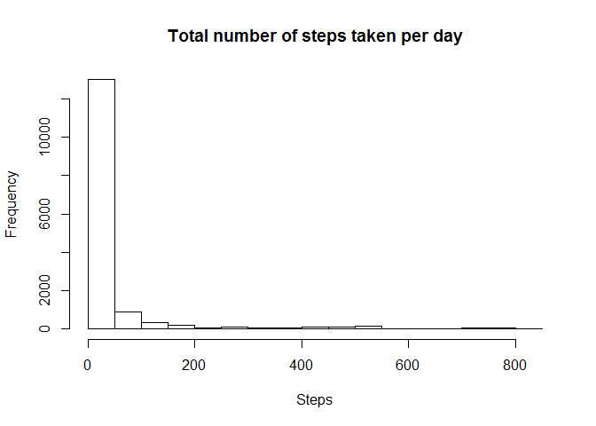
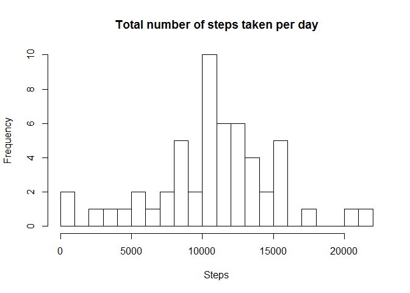
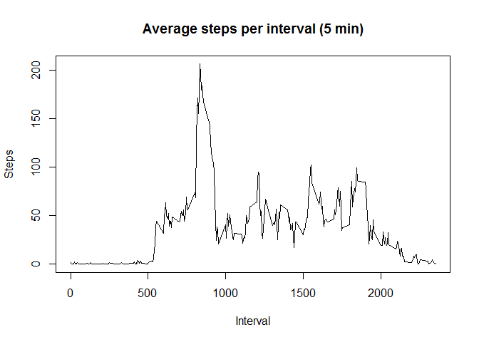
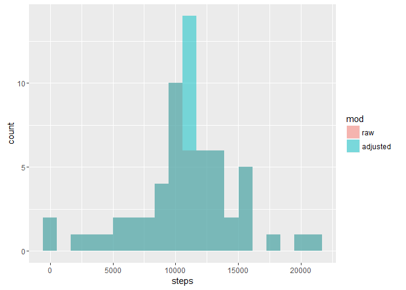
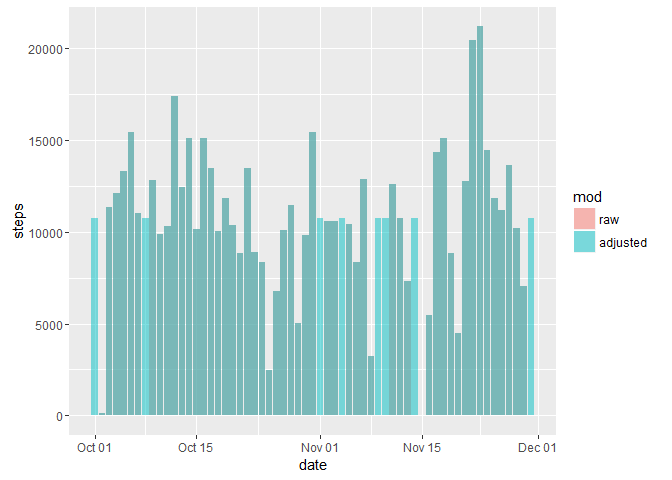
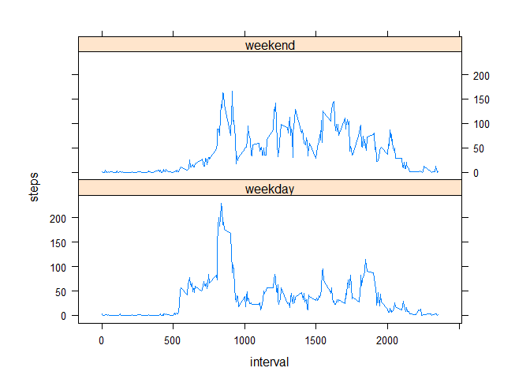

# Reproducible Research: Peer Assessment 1


```
## [1] "English_United States.1252"
```


## Loading and preprocessing the data


```r
rawData <- read.csv("activity.csv", sep = ",", header = TRUE)
rawData$date <- as.Date(rawData$date)
hist(rawData$steps, breaks = 20, main="Total number of steps taken per day", xlab="Steps", ylab="Frequency")
```

<!-- -->

## What is mean total number of steps taken per day?


```r
stepsAggByDate <- aggregate(steps ~ date, data = rawData, sum, na.rm = TRUE)
hist(stepsAggByDate$steps, breaks = 20, main = "Total number of steps taken per day", xlab="Steps", ylab="Frequency")
```

<!-- -->

```r
barplot(stepsAggByDate$steps, names.arg = stepsAggByDate$date)
```

<!-- -->

```r
totalSumSteps <- sum(stepsAggByDate$steps, na.rm = TRUE)
meanSteps <- mean(stepsAggByDate$steps, na.rm = TRUE)
medianSteps <- median(stepsAggByDate$steps, na.rm = TRUE)
```

The total number of steps taken per day is: 570608

The mean and median values are as following, removing the NAs:  
*Mean*: 10766  
*Median*: 10765

## What is the average daily activity pattern?


```r
avgDailyAct <- aggregate(steps ~ interval, data = rawData, mean, na.rm = TRUE)
plot(avgDailyAct$interval, avgDailyAct$steps, type="l", main = "Average steps per interval (5 min)", xlab = "Interval", ylab = "Steps")
```

<!-- -->

```r
maxStepsX <- which.max(avgDailyAct$steps)
maxStepsY <- avgDailyAct$interval[maxStepsX]
```

5-minute interval *835*, on average across all the days in the dataset, contains the maximum number of steps (*= 206*).

## Imputing missing values


```r
missingPoints <- sum(is.na(rawData$steps))
numRows <- nrow(rawData)
percentMissing <- missingPoints/numRows * 100
```

There are 2304 points missing out of 17568 records (13.11%).


```r
adjustedData <- rawData
stepsMeanByInterval <- aggregate(steps ~ interval, data = rawData, mean, na.rm = TRUE)
adjustedData$steps[is.na(adjustedData$steps)] <- 
  stepsMeanByInterval$steps[match(adjustedData$interval[is.na(adjustedData$steps)], stepsMeanByInterval$interval)]
stepsAggByDateAdj <- aggregate(steps ~ date, data = adjustedData, sum, na.rm = TRUE)
stepsRawAndAdj <- rbind(cbind(stepsAggByDate, mod = "raw"), cbind(stepsAggByDateAdj, mod = "adjusted"))
ggplot(data = stepsRawAndAdj, aes(steps, fill = mod)) + geom_histogram(alpha=.5, bins = 20, position="identity")
```

<!-- -->

```r
ggplot(data = stepsRawAndAdj, aes(x = date, y = steps, fill = mod)) + geom_bar(stat="identity", position = "identity", alpha=.5)
```

<!-- -->

The NA values have been replaced with a mean *steps* value from all the same *5-minute intervals*, i.e. if the data is missing for *interval = 5*, we take all the other *steps* values from all the other dates for that *interval* and calculate their mean.


```r
totalSumStepsAdj <- sum(stepsAggByDateAdj$steps, na.rm = TRUE)
meanStepsAdj <- mean(stepsAggByDateAdj$steps, na.rm = TRUE)
medianStepsAdj <- median(stepsAggByDateAdj$steps, na.rm = TRUE)
```

The total number of steps taken per day is: 656737

The mean and median values are as following, removing the NAs:  
*Mean*: 10766  
*Median*: 10766

While we observe quite a big change in number of steps (15.09%), the mean and the median are almost identical as for the raw data.

## Are there differences in activity patterns between weekdays and weekends?


```r
adjustedData$dayname <- weekdays(adjustedData$date)
adjustedData$weekend <- as.factor(ifelse(adjustedData$dayname == "Saturday" |
                                 adjustedData$dayname == "Sunday", "weekend", "weekday"))
plotdata <- aggregate(steps ~ interval + weekend, data = adjustedData, mean)
xyplot(steps ~ interval | factor(weekend), data = plotdata, aspect = 1/3, type = "l")
```

<!-- -->

The above plot contains a time series plot of the 5-minute interval (x-axis) and the average number of steps taken, averaged over all weekdays and weekends. The difference between them is clearly visible.
